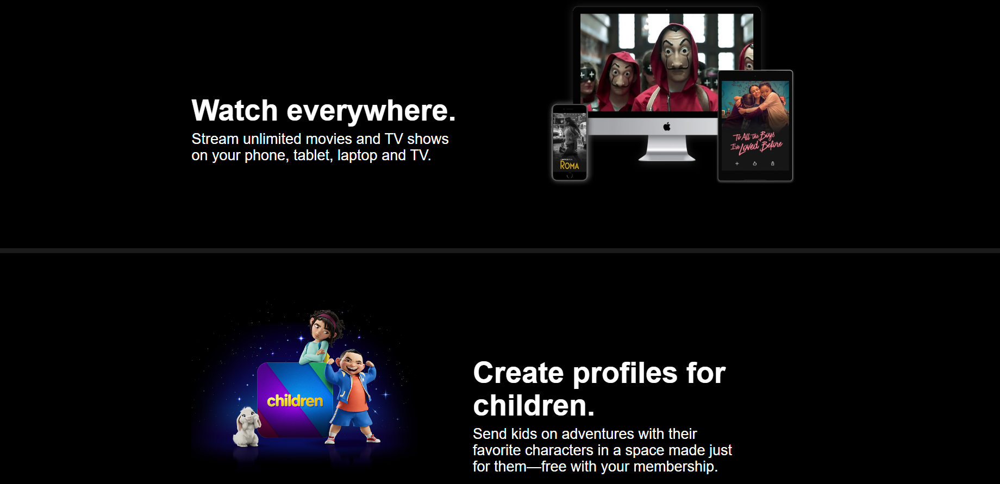

# Netflix Klonu

Bu proje, HTML, CSS ve JavaScript kullanarak oluşturduğum bir Netflix klonunu içerir. Bu klon, Netflix'in ana sayfasını ve giriş yapma ekranını taklit etmeyi amaçlar.

## Özellikler
- Ana Sayfa: Netflix benzeri bir arayüz ile film ve dizi önerileri sunar.
- Giriş Yap: Kullanıcı adı ve şifre ile oturum açmayı sağlar.

## Nasıl Kullanılır
1. Projeyi klonlayın veya indirin.
2. Ana dizindeki `index.html` dosyasını web tarayıcınızda açın.

## Ekran Görüntüleri

## Katkıda Bulunma
- Projeyle ilgili her türlü katkıya açığız. Kodunuzu paylaşmak veya hata düzeltmeleri yapmak için bir çekme isteği (pull request) gönderebilirsiniz.

## İletişim
- GitHub: [GitHub Profili](https://github.com/yunusemrebayik)
- LinkedIn: [LinkedIn Profili](https://www.linkedin.com/in/yunuseb/)

# Netflix Clone

This project includes a Netflix clone that I created using HTML, CSS, and JavaScript. The clone aims to mimic the Netflix homepage and login screen.

## Features
- Homepage: Presents movie and series recommendations with a Netflix-like interface.
- Login: Allows users to log in with a username and password.

## How to Use
1. Clone or download the project.
2. Open the `index.html` file in your web browser from the main directory.

## Screenshots

## Contribution
- We welcome any contributions related to the project. You can submit a pull request to share your code or make bug fixes.

## Contact
- GitHub: [GitHub Profile](https://github.com/yunusemrebayik)
- LinkedIn: [LinkedIn Profile](https://www.linkedin.com/in/yunuseb/)
